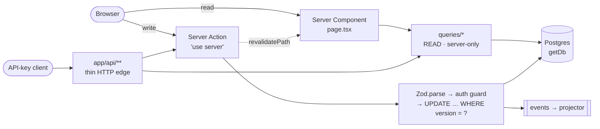
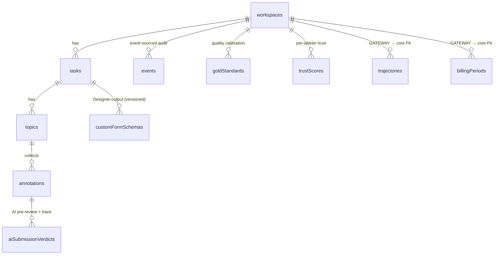
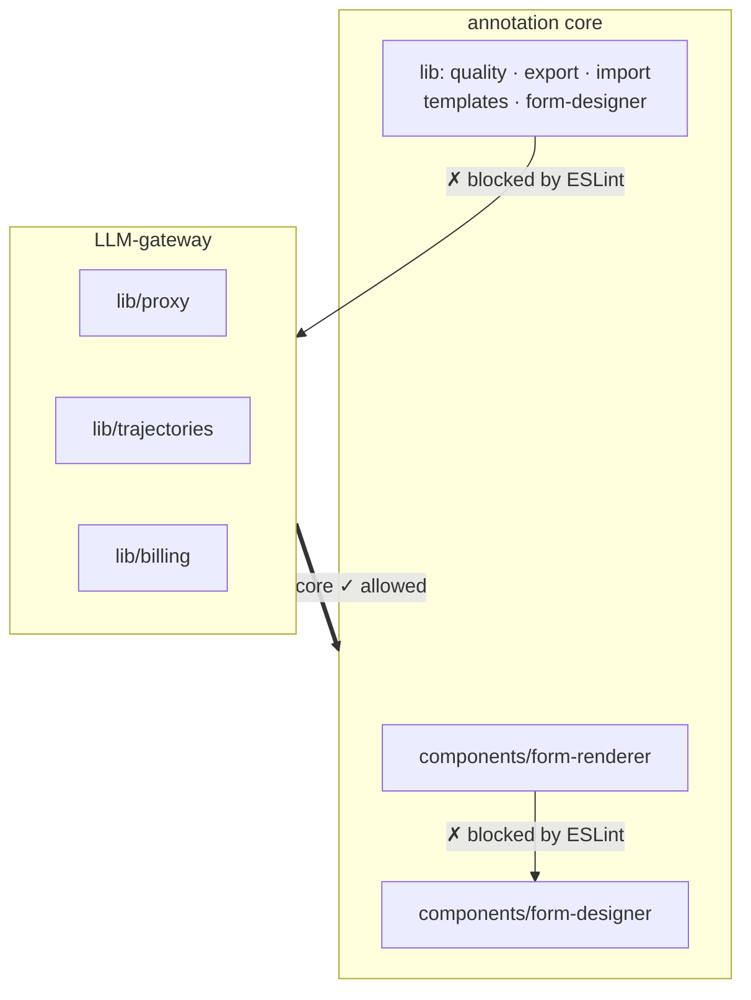

# LabelHub — Architecture

> A data-annotation platform: an Owner builds tasks and drag-and-drop form
> templates → Labelers annotate → an AI agent pre-reviews submissions →
> human Reviewers accept or send back → datasets export in JSON / JSONL /
> CSV / Excel. Built on **Next.js 16 (App Router) + React 19 + TypeScript +
> Drizzle/Postgres + Supabase Auth**.

This document is the map of the codebase: the layer contract, the directory
layout, the data model, and the conventions that keep it maintainable. If
you only read one file before changing things, read this one.

---

## 1. The dual identity (read this first)

LabelHub is really **two products in one repository**, and knowing which
half you're touching prevents most confusion:

| | **Core — the annotation platform** | **Gateway — the LLM-ops layer** |
|---|---|---|
| Purpose | The spec'd product: tasks, templates, labeling, review, export | An earlier "LLM gateway / eval" thesis kept around |
| Domain | workspaces → tasks → topics → annotations → review → quality → export | trajectory capture, LLM judges, eval-runs, billing/payouts, disputes, provider connections, API/SDK |
| Routes | `/admin/*`, `/my/*`, `/review/*`, `/workspaces/[id]` + `/tasks`, `/quality`, `/audit`, `/members`, `/settings`, `/activity` | `/workspaces/[id]/{trajectories,judges,eval-runs,billing,disputes,connections,api,analyze}` |
| lib | `lib/{actions,queries,form-designer,import,export,quality,ai,events,templates}` (core slices) | `lib/{proxy,trajectories,billing}` + judge/consensus slices |
| Schema | `db/schema/core.ts` | `db/schema/{proxy,trajectories,billing,judges,consensus}.ts` |

The gateway half is **wired-in and tested** — it is not dead code — but on a
plain annotation deployment its pages render empty/demo-gated. That is why
**focus mode** (§5) hides the gateway entry points by default. When adding
features, keep core code from reaching into gateway internals; see §9.

---

## 2. Tech stack

- **Next.js 16 App Router**, React 19, TypeScript `strict`.
- **Drizzle ORM** over **Postgres** (`postgres` driver). One DB accessor:
  `getDb()` in `src/lib/db/client.ts`.
- **Supabase Auth** via `@supabase/ssr` (cookie sessions). See
  `src/lib/supabase/*` and `src/app/auth/callback/route.ts`.
- **@dnd-kit** for the form Designer drag-and-drop.
- **Zod** for all input validation and structured LLM output.
- **Jotai** + `@tanstack/react-query` + `dexie` (IndexedDB autosave) on the
  client; `@tanstack/react-virtual` for large grids.
- **xlsx** for Excel import/export; **react-markdown** + rehype/remark for
  rich text and guidelines.
- **vitest** for unit/integration tests (~1109 tests across 106 files) + **Playwright** for e2e (public smoke + seeded lifecycle; see e2e/README.md).
- Local file storage driver for uploads/exports (`src/lib/storage`,
  `src/lib/export/storage.ts`) — chosen over Supabase Storage for the small
  domestic VPS deployment.

---

## 3. Layered server architecture (the contract)

The discipline here is unusually strong for a project this size. Respect it.

```
src/app/**          Pages (mostly Server Components) + route handlers (HTTP edges)
src/components/**    Client tier (UI). Pages fetch data and pass it down.
src/lib/
  db/                Drizzle schema (domain modules behind a barrel) + getDb()
  queries/           READ-only. Every file starts with `import 'server-only'`.
  actions/           WRITE. Every file starts with `'use server'`.
  ...capability slices (form-designer, import, export, quality, ai, events, …)
```

**The four rules that must not rot:**

1. **`queries/` is read-only and server-only.** Every file begins with
   `import 'server-only'`; pure Drizzle selects + event-fold projections, no
   mutations. Pure scoring kernels (e.g. `queries/iaa-math.ts`) are
   deliberately split out with **no** `server-only`/DB import so they're unit
   testable.
2. **`actions/` mutate.** Every file begins with `'use server'`, validates
   input with **Zod**, calls a centralized auth guard
   (`requireUser` / `requireWorkspaceMember` / `requireWorkspaceAdmin` from
   `src/lib/auth/guards.ts`, called across the action layer), enforces payload byte
   budgets, emits **events**, fans out webhooks/notifications, and calls
   `revalidatePath`. Optimistic concurrency uses a row `version` column
   (`UPDATE … WHERE id = ? AND version = ?` then bump).
3. **Route handlers (`src/app/api/**`) are thin external edges** for
   API-key / external surfaces (proxy, ingest, export, webhooks). They
   authenticate, then delegate to lib. **Internal UI never calls API routes
   for mutations — it uses Server Actions.**
4. **Components are the client tier.** Pages are Server Components that fetch
   via `queries/` and pass plain data down.

Errors use a typed hierarchy (`src/lib/errors.ts`:
`ConflictError` / `ForbiddenError` / `NotFoundError` / `ValidationError`),
not ad-hoc throws — one place to harden behavior. Path alias `@/*` keeps
imports stable.

**Request paths at a glance** — reads go straight through `queries/*`; writes
always pass Zod → an auth guard → a version-checked `UPDATE` → events, then
revalidate:



---

## 4. Data model

`db/schema/` (re-exported by `db/schema.ts`, the barrel that every importer
and `drizzle.config.ts` resolves):

```
workspace → tasks → topics → annotations            (the core spine)
            + events            (event sourcing; replay-safe derived state)
            + guidelines + guidelinePatches  (living guidelines)
            + goldStandards / trustScores    (quality calibration)
            + customFormSchemas              (Designer output; versioned)
            + aiSubmissionVerdicts           (AI pre-review results + trace)
            + exportJobs                     (async multi-format export)
```

Gateway tables (proxy/trajectories/billing/judges/consensus) live in their
own schema modules and reference core tables by FK — the dependency points
**gateway → core**, never the reverse (§9).



(Only the core spine + its direct satellites are shown; the gateway clusters —
proxy, trajectories, billing, judges, consensus — hang off `workspaces` /
`tasks` by FK and are detailed in their own schema modules.)

Events + `events/projector.ts` (a tiny pure fold) + per-domain projections
give replay-safe derived state through a clean `Projection<TState>`
interface.

---

## 5. Focus mode — `src/lib/workspace-nav.ts`

`LABELHUB_FOCUS_MODE` (**default ON**) is the single switch that hides the
gateway-era entry points so the workspace only surfaces the core annotation
flow. It does **not** remove routes — direct URLs still work — it only gates
the **entry points** (the cockpit tile grid and the workspace sub-nav).

- `isFocusMode()` — reads the env flag; only `false`/`0`/`off`/`no` opt out.
- `WORKSPACE_SECTIONS` — the canonical, ordered section list, each tagged
  `category: 'core' | 'gateway'` (+ optional `modes` filter mirroring the
  per-template-mode gating).
- `visibleWorkspaceSections(templateMode, focus)` — the filtered list both
  the cockpit and the sub-nav consume, so they never drift apart.

To surface the full gateway product again, set `LABELHUB_FOCUS_MODE=false`.

Template modes (`src/lib/templates/types.ts`): `custom-designer` (the
flagship annotation mode the spec targets), `pair-rubric`, `arena-gsb`,
`agent-trace-eval` (gateway-flavored).

---

## 6. Navigation

- **`AppHeader`** (`src/components/app-shell/app-header.tsx`) — persistent,
  role-aware top bar mounted by the `/my`, `/admin`, `/review`,
  `/workspaces` layouts (Tasks / Review / Admin pills + Inbox + user menu).
- **Workspace sub-nav** (`src/components/workspaces/workspace-subnav.tsx`,
  mounted by `src/app/workspaces/[id]/layout.tsx`) — the in-workspace spine:
  a breadcrumb back to the workspace overview plus section tabs from
  `visibleWorkspaceSections`. It self-hides on immersive full-bleed routes
  (the annotator, the trajectory inspector) where a top bar would fight the
  100vh panes.

---

## 7. Theme system — light-first via `.app-light`

The app renders on a **light ("Anthropic/Linear-light") palette** defined
under the `.app-light` scope in `src/app/globals.css` (tokens: `--bg`,
`--panel`, `--panel2`, `--line`, `--line2`, `--text`, `--hi`, `--mute`,
`--mute2`, `--accent`, status colors, plus `ts-*` type scale and component
primitives). Every signed-in layout wraps its children in
`.app-light`, and the marketing landing (`src/app/page.tsx`), `/signin`,
`/signup`, and `/docs` are light too.

Conventions:
- Inside `.app-light`, style with the `var(--…)` tokens, not raw `oklch`.
- The only intentional **dark** exception is the code-panel styling in
  `/docs` (`.docs-code*`) and tool-call/JSON viewers (`--code-*` tokens) —
  code reads better on dark.
- `<html>` still carries `class="dark"` and the dark `:root` tokens still
  exist. They are now effectively unused by rendered surfaces but flipping
  `:root` to light + dropping `html.dark` was **deliberately deferred**
  because it touches every shadcn-token consumer at once (high blast
  radius). Do it as its own audited change; until then, new pages must opt
  into `.app-light` or they silently render dark.

---

## 8. Spec → implementation map

All six assignment areas are implemented (verified against source):

| Spec | Where |
|---|---|
| 4.1 Owner task mgmt + lifecycle + import | `lib/actions/tasks.ts`, `lib/actions/topics.ts`, `lib/import/*`, `components/task-admin/{create-task-form,import-wizard}.tsx` |
| 4.2 Designer + Renderer (decoupled, shared schema) | `components/form-designer/*`, `components/form-renderer/*`, `lib/form-designer/*` (ESLint-enforced separation, §9) |
| 4.3 Labeler workbench | `app/my/*`, `app/workspaces/[id]/topics/[topicId]/annotate`, `components/topic-annotate/*` |
| 4.4 AI review agent | `lib/actions/ai-review-submission.ts`, `lib/ai/review-agent.ts` (Zod-validated JSON output; verdicts pass/send_back/human_review; retry + idempotency; raw prompt trace in `aiSubmissionVerdicts`) |
| 4.5 Human review state machine | `lib/quality/state-machine.ts`, `lib/actions/{qc-review,review-batch}.ts`, `components/review/*` |
| 4.6 Multi-format export | `lib/export/*`, `app/api/.../export`, `app/admin/exports` |

---

## 9. Conventions & invariants

- **Machine-enforced boundaries:** `eslint.config.mjs` carries two
  `no-restricted-imports` fences — (1) `form-renderer/**` may not import
  Designer UI (the spec's Designer/Renderer decoupling gate), and (2) the
  annotation-core library slices (`lib/{quality,export,import,form-designer,templates}/**`)
  may not import the LLM-gateway layer (`lib/{proxy,trajectories,billing}/**`).
  Mirror this pattern for new boundaries.
- **Gateway boundary (see §1):** the dependency points **gateway → core**,
  never the reverse. proxy/** and trajectories/** are already gateway-clean,
  and the core slices above are CI-fenced. The previously-exempt crossing —
  `actions/annotations.ts` → `lib/billing` (invite-reward + payout accrual on
  approval) — is now **inverted**: core dispatches `annotation.approved` on the
  in-process event bus (`lib/events/dispatch.ts`) and the billing gateway
  subscribes at boot (composition root `src/instrumentation.ts` →
  `lib/billing/init.ts`). `actions/annotations.ts` is itself now CI-fenced
  against billing/gateway imports (§11.3).
- **Optimistic concurrency** via row `version`; **events** are the audit
  trail; **typed errors** over ad-hoc throws.
- **Type safety:** `strict: true`, only a handful of real `any` (dynamic-form
  value paths). Keep it that way.



> Thick arrow = allowed dependency. Labelled thin arrows are CI-blocked
> imports (a violation fails `npm run lint`). The former core→billing crossing
> (`actions/annotations.ts` → billing) is now inverted via the event bus and
> CI-fenced (§11.3) — core no longer imports the gateway.

---

## 10. Local development

```bash
# 1. Clean macOS extraction junk if you unpacked the source tarball
find . -name '._*' -not -path './node_modules/*' -delete
find . -name '.DS_Store' -not -path './node_modules/*' -delete

# 2. Test fixtures (official datasets) for finals-fixtures.test.ts
#    unzip the course test-data.zip into ./tmp-data so it contains
#    tmp-data/datasets/{qa_quality,preference_compare}/...

npm install
npm test          # ~1109 tests across 106 files
npm run build     # validates types (generates Next PageProps types)

# Self-contained Postgres dev stack (no Supabase; auth degrades):
docker compose up
docker compose exec app npm run db:push
npm run seed:finals-demo   # seeds the qa_quality + preference_compare demo
```

Useful env flags: `LABELHUB_FOCUS_MODE` (default on; §5),
`LABELHUB_DEMO_MODE` (surfaces demo-only write paths on gateway pages).
Production storage: `STORAGE_DRIVER=local`, `LOCAL_STORAGE_DIR`,
`LOCAL_STORAGE_BASE_URL` (see `NETWORK_AND_DEPLOYMENT.md`).

---

## 11. Recommended next refactors (maintainability backlog)

Ordered by ROI vs risk. None block shipping; all are tracked here so the
conventions don't silently rot.

1. **Decompose the client god-components** (highest day-to-day pain, low
   risk, mechanical): `components/task-admin/create-task-form.tsx` (~1.9k
   lines, 23 `useState`), `components/eval-run/eval-run-client.tsx` (~1.6k),
   `components/task-admin/import-wizard.tsx` (~1.1k),
   `components/billing/earnings-dashboard.tsx`. Extract sub-panels/steps into
   child components and move clustered state into a reducer or Jotai atoms
   (already a dependency). Behavior-preserving; shrinks merge-conflict
   surface and unlocks unit tests.
2. **Thin the fat server pages** (extract presentational JSX into co-located
   subcomponents; keep `page.tsx` a data-fetch+compose shell):
   `trajectories/[trajId]/page.tsx` (~1.6k), `quality/page.tsx` (~1.1k),
   `tasks/page.tsx`, `topics/[topicId]/annotate/page.tsx`.
3. **Gateway boundary — done (§9).** The core library slices are ESLint-fenced
   from the gateway layer, and the last core→gateway call-site
   (`actions/annotations.ts` → `lib/billing`, invite-reward + payout accrual on
   approval) is now **inverted**: `reviewAnnotation` dispatches
   `annotation.approved` on the core event bus (`lib/events/dispatch.ts`); the
   billing gateway subscribes (`lib/billing/subscribers/annotation-approved.ts`)
   and is wired at boot by the composition root (`src/instrumentation.ts` →
   `lib/billing/init.ts`). `actions/annotations.ts` is itself now fenced against
   billing/gateway imports, so the inversion can't regress.
4. **Unify the agreement/consensus vocabulary:** route
   `queries/trust-consensus.ts` and `queries/topic-peer-consensus.ts` through
   the `queries/iaa-math.ts` tolerance/dispute primitives so there is one
   canonical "agreement" definition; document Dawid-Skene as a distinct,
   cross-referenced model.
5. **Close the dynamic-form `any` holes:** a shared `FormValue` union used by
   `form-renderer`, `form-designer/serialize`, and validation.
6. **Keep deleting confirmed dead code** as it surfaces. Removed so far: the
   `components/site/gateway-pillars.tsx` / `gateway-snippet.tsx` landing
   sections; and a later sweep of seven orphaned `actions/{ai,tool-providers,
   trajectories,step-annotations}.ts` + `queries/{timeseries,tool-providers,
   current-user}.ts` files plus two unused components (`ui/button.tsx`,
   `form-renderer/form-renderer-skeleton.tsx`), which let `@base-ui/react` and
   `class-variance-authority` drop from `package.json`.
7. **Theme `:root` flip** (§7): make light the default and drop `html.dark`
   as a separate, carefully-audited change.
